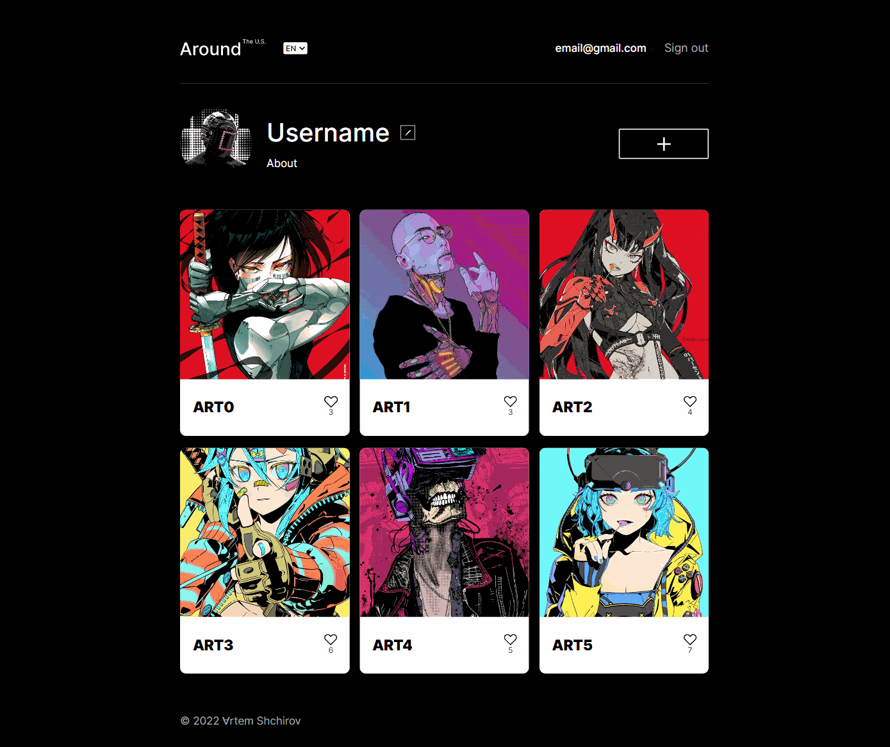
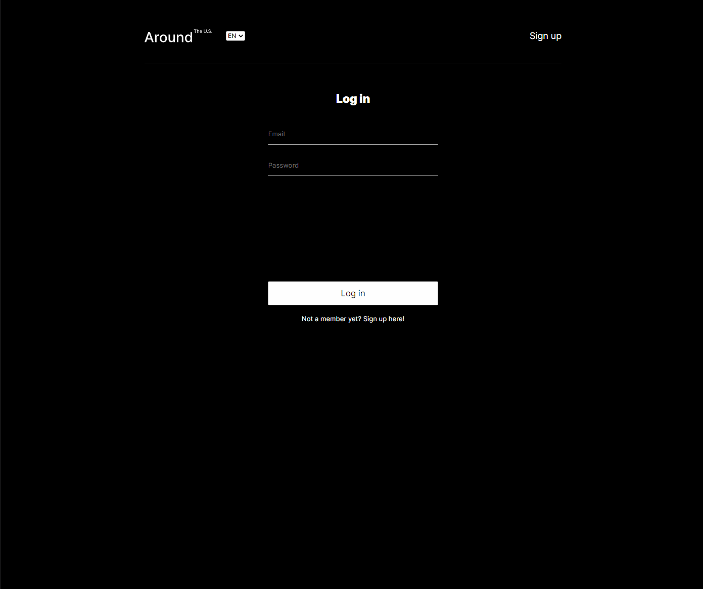
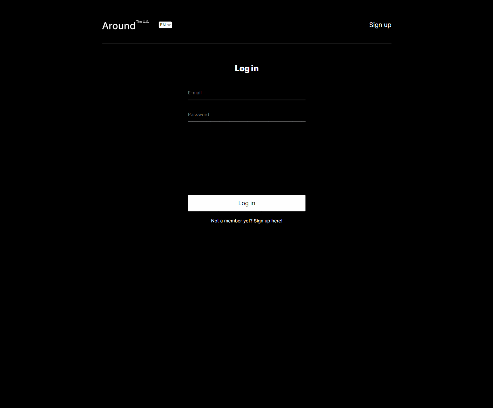
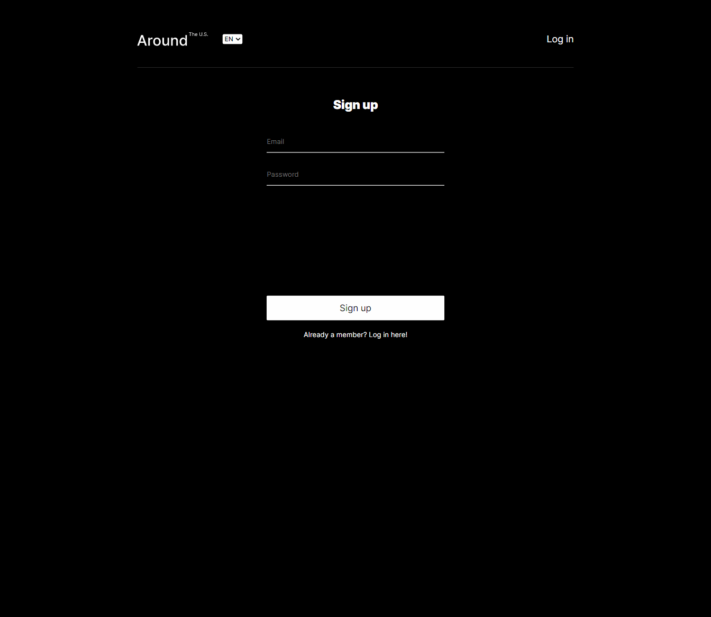

# FINAL VERSION OF AROUND

## Have a look at the project

<https://around.nomoredomains.sbs>

Public IP of the server: `51.250.96.109`

## Description

The repository that unites the frontend and backend parts of the Mesto student project - a web application for sharing photos with the functionality of user registration and authentication.

The application was deployed on the remote server and the domain name was assigned to it.

## Links

[See readme of here to learn about the frontend functionality of the project](https://github.com/artemshchirov/react-around-api-full/tree/main/frontend)

[Project backend](https://github.com/artemshchirov/react-around-api-full/tree/main/backend)

<h2 style="text-align: center;"> Demo Functionality </h3>

<h3 style="text-align: center;">Adaptive</h3>

<h3 style="text-align: center;">Add / delete cards</h3>

<h3 style="text-align: center;">Edit user info</h3>

<h3 style="text-align: center;">Add / remove like</h3>

<h3 style="text-align: center;">Open / close cards</h3>

<h3 style="text-align: center;">Localization</h3>

<h3 style="text-align: center;">Access control</h3>

<h3 style="text-align: center;">Form validation</h3>

